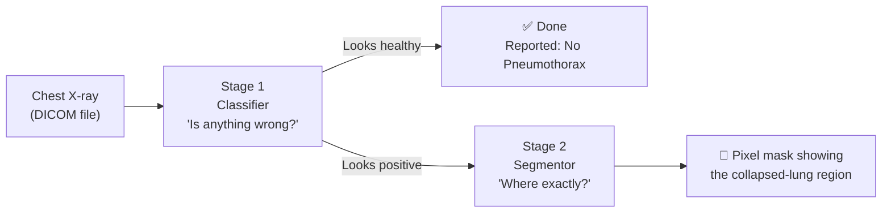
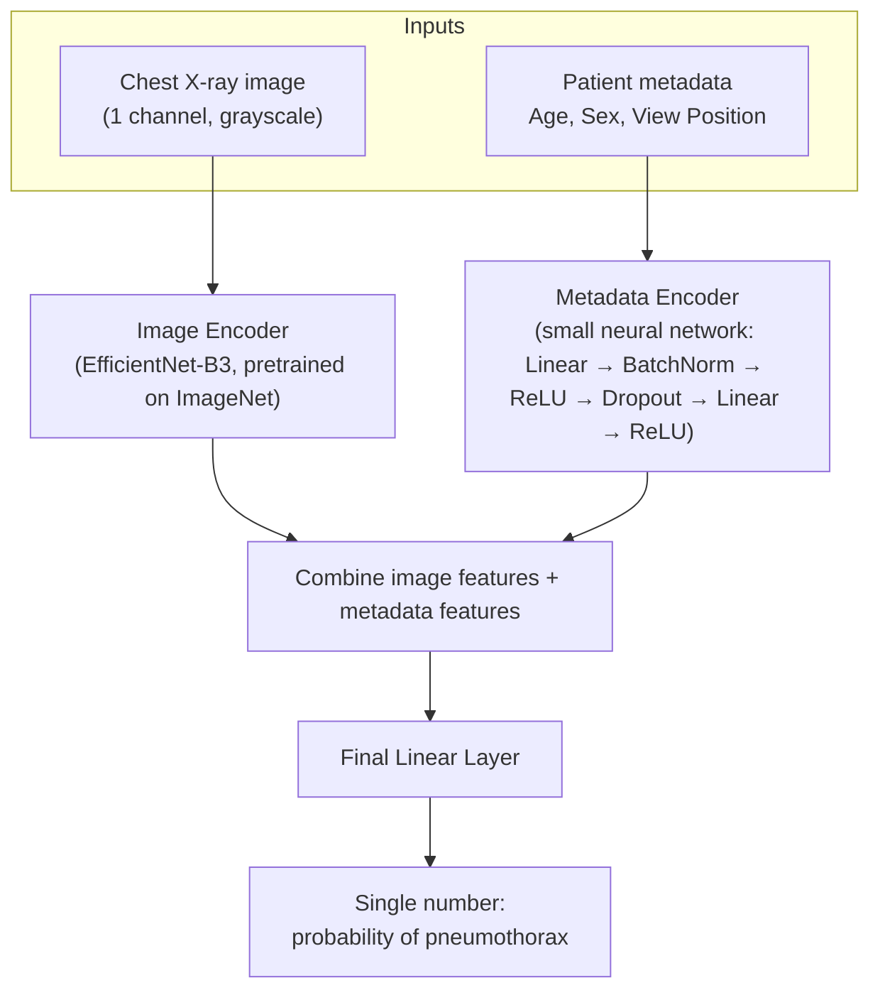
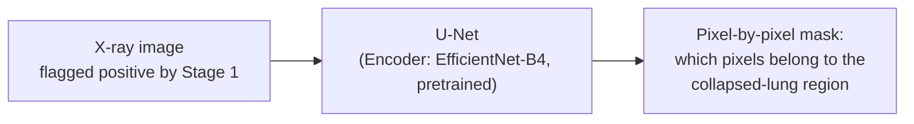

# CXRay-Pneumothorax-Segmentation

An AI pipeline that looks at a chest X-ray and answers two questions:

1. **Does this X-ray show a pneumothorax** (a collapsed lung)?
2. **If yes, exactly where** in the image is it?

It's built as a **two-stage pipeline** rather than one big model — the reasoning behind that, and everything else in the repo, is explained below in plain language.

> Built from the [SIIM-ACR Pneumothorax Segmentation](https://www.kaggle.com/c/siim-acr-pneumothorax-segmentation) Kaggle competition, refactored from a single Kaggle notebook into a modular codebase.

---

## Table of Contents
1. [The Big Idea](#the-big-idea)
2. [Repository Structure](#repository-structure)
3. [Model Architecture](#model-architecture)
4. [How the Code Works, File by File](#how-the-code-works-file-by-file)
5. [Understanding the Interpretation Notebooks](#understanding-the-interpretation-notebooks)
6. [Setup & How to Run](#setup--how-to-run)
7. [Key Metrics Explained](#key-metrics-explained)
8. [License](#license)

---

## The Big Idea

Think of it like a hospital triage process:



**Why two stages instead of one model that does everything?**
- Most chest X-rays in this dataset are healthy. Asking a model to precisely outline "where" a disease is on an image that doesn't have the disease wastes computation and gives it more chances to hallucinate a wrong region.
- Stage 1 is a fast, cheap **filter**: healthy vs. not-healthy.
- Stage 2 is a slower, more careful **cartographer** that only ever runs on the images Stage 1 flagged, so it can spend all its effort drawing an accurate outline.

This is a very common pattern in medical imaging AI, sometimes called a "detect-then-segment" or "gate-then-refine" pipeline.

---

## Repository Structure

```
CXRay-Pneumothorax-Segmentation/
├── configs/
│   └── configs.py              # All settings in one place (paths, model choices, hyperparameters)
├── scripts/
│   ├── download_data.sh        # Pulls the X-ray dataset from Kaggle
│   └── download_weights.sh     # Pulls pretrained model checkpoints from Kaggle
├── src/
│   ├── main.py                 # The "run everything" entry point for training
│   ├── data/
│   │   ├── prepare.py          # Reads DICOMs + labels, builds the tables the models train on
│   │   ├── Dataset.py          # The PyTorch Dataset: turns one row into (image, mask, metadata)
│   │   ├── preprocessing.py    # Turns a raw DICOM into a clean, normalized image array
│   │   └── augment.py          # Defines the image augmentations used during training
│   ├── models/
│   │   ├── classifier.py       # Stage 1 model definition
│   │   └── segmentor.py        # Stage 2 model definition
│   ├── training/
│   │   ├── train_classifier.py # Trains Stage 1, with validation + early stopping
│   │   ├── train_segmentor.py  # Trains Stage 2, with validation + early stopping
│   │   └── train_cls_seg.py    # Trains both models back-to-back on the full dataset
│   ├── inference/
│   │   ├── inference.py        # Runs the full two-stage pipeline on a batch of images
│   │   └── run_inference.py    # Script: load checkpoints, run inference, write a submission file
│   ├── interpretation/         # Notebooks that explain *why* the model predicts what it predicts
│   │   ├── evaluate_holdout.ipynb
│   │   ├── error_analysis.ipynb
│   │   └── tp_cases.ipynb
│   ├── EDA/
│   │   └── eda-of-pneumothorax-dataset.ipynb   # First look at the raw dataset
│   ├── base-models/
│   │   └── basemodels.ipynb    # Simple non-deep-learning baselines for comparison
│   ├── Deployment/
│   │   └── app.py              # The Gradio web app — upload an X-ray, get a diagnosis
│   └── utils/
│       └── utils.py            # Shared helper functions (metrics, mask encoding/decoding, seeding)
├── notebook/
│   └── pneumothorax-seg-model (7).ipynb   # The original, single-file Kaggle notebook this repo grew out of
├── requirements.txt
├── LICENSE
└── README.md
```

**Rule of thumb for navigating this repo:** if you want to know *what data goes in*, look in `src/data/`. If you want to know *what the model is*, look in `src/models/`. If you want to know *how it's trained*, look in `src/training/`. If you want to know *why it decided what it decided*, look in `src/interpretation/`.

---

## Model Architecture

### Stage 1 — The Classifier: "Is anything wrong here?"

**File:** `src/models/classifier.py` — class `MedicalFusionClassifier`



In plain terms:
- The **image encoder** is EfficientNet-B3, a well-known, efficient convolutional network. It's "pretrained," meaning it already knows how to recognize general shapes and textures from millions of everyday photos before ever seeing an X-ray — this head start (transfer learning) means the model needs far less X-ray data to learn well.
- The **metadata encoder** is a tiny neural network that processes three numbers: the patient's age, sex, and which direction the X-ray was taken from (AP = "front-facing, often for very sick/bedridden patients" vs. PA = "standard standing X-ray"). These details genuinely correlate with pneumothorax risk in the data, so feeding them in alongside the image gives the model extra clues a pure image model wouldn't have.
- The two streams of information (image + metadata) are concatenated ("fused") and passed through one final layer that outputs a single number: how confident the model is that this X-ray shows a pneumothorax.

### Stage 2 — The Segmentor: "Where exactly is it?"

**File:** `src/models/segmentor.py` — function `build_stage2_segmentor`



- This uses a **U-Net**, the standard architecture for "outline the exact shape of something" tasks in medical imaging. A U-Net first shrinks the image down to understand *what* is in it (using an EfficientNet-B4 encoder, again pretrained), then expands it back up to full resolution to decide, pixel by pixel, *where* it is.
- It only ever processes images that Stage 1 already flagged as positive — it never wastes effort on X-rays that are probably healthy.
- The output isn't a single number like Stage 1 — it's a full-resolution map the same size as the input image, where each pixel gets a score for "does this pixel belong to the pneumothorax region?"

### Why train them separately?
Each model has a different, focused job. Training them as two smaller specialists (rather than one enormous multi-task model) makes each one easier to train, debug, and improve independently — you can retrain just the classifier without touching the segmentor, and vice versa.

---

## How the Code Works, File by File

### Data pipeline (`src/data/`)

| File | What it does, in plain English |
|---|---|
| `prepare.py` | Walks through the folders of `.dcm` (DICOM) X-ray files, reads each patient's metadata (age, sex, view position) directly out of the DICOM headers, and matches each image to its label from the competition's CSV file (which tells you whether — and where — a pneumothorax is present, using a compact "run-length encoding" of the mask). The result is one big table (a pandas DataFrame) with one row per X-ray. |
| `preprocessing.py` | Takes a raw DICOM file and turns it into a normal, clean image: some X-ray machines store images "inverted" (bright = air, dark = bone) — this function detects and fixes that — then it stretches the pixel brightness values to use the full 0–255 range so the image has good contrast. |
| `augment.py` | Defines the image augmentation recipes used to artificially create more training variety: for training, images get randomly flipped, rotated, slightly distorted, and contrast-adjusted so the model doesn't just memorize the exact pixels it was trained on. For validation/inference, only resizing and normalization are applied — no randomness, so results are consistent. |
| `Dataset.py` | The bridge between the DataFrame from `prepare.py` and PyTorch. For any given row, it loads the image, decodes the mask from its compact text encoding into an actual 1024×1024 grid of 0s and 1s, applies the chosen augmentations, and hands back everything a training loop needs: `(image, mask, metadata, label, index, patient_id)`. |

### Model definitions (`src/models/`)
Covered above in [Model Architecture](#model-architecture).

### Training (`src/training/`)

| File | What it does |
|---|---|
| `train_classifier.py` | Trains Stage 1 with a proper train/validation split, tracks accuracy-style metrics (AUC, F2 score, G-Mean) every epoch, automatically finds a good decision threshold from the validation data, and stops early if validation performance stops improving. |
| `train_segmentor.py` | Same idea as above, but for Stage 2: trains only on X-rays that actually have a pneumothorax, tracks the Dice score (see [Key Metrics](#key-metrics-explained)) every epoch, and stops early once it stops improving. |
| `train_cls_seg.py` | A leaner version used for the **final** model: once you're happy with how many training epochs each stage needs (learned from the validation runs above), this trains both models back-to-back on *all* the available labeled data — no data held back — to squeeze out the best possible final model before submission/deployment. |

Both classifier training scripts use a **progressive resizing** trick: early epochs train on smaller, faster 256×256 images to learn general patterns quickly, then later epochs step up to larger 512×512 (and for the segmentor, up to 1024×1024) images to fine-tune on fine detail. This is a common way to speed up training without sacrificing final quality.

### Inference (`src/inference/`)

| File | What it does |
|---|---|
| `inference.py` | The core two-stage prediction function: runs every image through the classifier first, then only sends the ones predicted positive through the segmentor, then converts the predicted mask back into the competition's compact text format. |
| `run_inference.py` | A ready-to-run script: loads both trained checkpoints, runs `inference.py` over the full competition test set, and writes out a `submission.csv` in the exact format Kaggle expects. |

### Deployment (`src/Deployment/app.py`)
A [Gradio](https://www.gradio.app/) web app — the simplest way to actually *use* the model. A user uploads a DICOM X-ray file and fills in age/sex/view position, and the app returns a plain-English diagnosis plus (if positive) a red overlay showing where the model thinks the pneumothorax is.

### Shared utilities (`src/utils/utils.py`)
Small helper functions used everywhere else in the codebase:
- `rle2mask` / `mask2rle`: convert between the competition's compact text encoding of a mask and an actual image-shaped grid of 0s/1s.
- `calculate_dice_coef`: computes the Dice score (see below).
- `f2_best_threshold`, `gmean_best_threshold`, `custom_threshold`: different strategies for picking the "how confident does the model need to be before saying yes" cutoff.
- `seed_everything`: sets random seeds across Python, NumPy, and PyTorch so training runs are reproducible.

### Configuration (`configs/configs.py`)
All the "knobs" of the project — dataset paths, model choices, batch sizes, learning rates, thresholds — live in one typed Python file instead of being scattered as magic numbers. This is meant to be the single source of truth: change a value here rather than hunting through training scripts.

---

## Understanding the Interpretation Notebooks

This is the part of the project that answers *"okay, but can I trust it, and why does it make the mistakes it makes?"* — arguably the most important section for a medical AI project, since a model that's simply "82% accurate" tells you very little about whether it's safe to rely on.

### `EDA/eda-of-pneumothorax-dataset.ipynb` — Getting to know the data
Before building any model, this notebook explores the raw dataset: how many X-rays actually have a pneumothorax, how age and sex relate to it (interestingly, young men show up disproportionately often — consistent with the known medical fact that "primary spontaneous pneumothorax" tends to affect tall, thin, young men), how the AP/PA view position affects things, and what the decoded masks actually look like on top of a real X-ray. This step is what informs choices made later, like including age/sex/view as model inputs.

### `base-models/basemodels.ipynb` — Simple baselines before the real model
Before trusting a complex deep learning model, it's good practice to check: *how well can you do with something dumb and simple?* This notebook tries a handful of baselines using **only the patient metadata** (age, sex, view position) — no image at all:
- Always predicting "healthy"
- Always predicting "positive"
- Random guessing
- Logistic Regression, XGBoost, and Random Forest on just those three metadata columns

The point isn't that these are meant to be used — it's a sanity check and a scoreboard. If the real image-based model can't clearly beat "a random forest looking at nothing but age and sex," that's a red flag that the image data isn't adding much value.

### `interpretation/evaluate_holdout.ipynb` — How good is the classifier, really?
This loads the trained classifier and segmentor, runs them on a held-out validation set (X-rays the model never trained on), and computes a **confusion matrix**: how many true positives, false positives, true negatives, and false negatives there were, plus precision and recall. In a medical screening context, **recall** (how many actual pneumothorax cases the model catches) usually matters more than raw accuracy — missing a real case is a far more costly mistake than a false alarm.

### `interpretation/error_analysis.ipynb` — Looking at the model's mistakes
This is where the project gets genuinely interpretable. It uses a technique called **Grad-CAM**, which produces a heatmap over the X-ray showing which regions of the image most influenced the model's decision — like a spotlight showing where the model was "looking." For each mistake the classifier made, the notebook shows a 3-panel comparison:

1. The original X-ray
2. The Grad-CAM heatmap (where the model focused)
3. The relevant mask — for a **missed case** (false negative), the true location of the pneumothorax it failed to notice; for a **false alarm** (false positive), the model's own hallucinated prediction

This lets you visually check things like: "did the model miss this case because the pneumothorax was very small and subtle, or was it looking at a completely irrelevant part of the image?" That distinction matters a lot for deciding how to improve the model next.

### `interpretation/tp_cases.ipynb` — Confirming the model gets things right for the right reasons
Even when the model is *correct*, it's worth checking *why*. This notebook takes the model's **true positives** (cases it correctly flagged as pneumothorax) and shows a 4-panel view: the original image, the Grad-CAM attention heatmap, the true mask, and the predicted mask, side by side. The goal is to confirm the model's attention actually overlaps with the real collapsed-lung region — rather than, say, getting the right answer by coincidentally focusing on a chest tube or hospital equipment that tends to appear alongside real pneumothorax cases in the training data (a classic way medical AI models can be "right for the wrong reason").

**In short:** the EDA notebook explains the data, the baseline notebook sets a floor to beat, `evaluate_holdout` tells you the numbers, and `error_analysis` / `tp_cases` tell you the *story* behind those numbers.

---

## Setup & How to Run

### 1. Install dependencies
```bash
pip install -r requirements.txt
```

### 2. Download the dataset
Requires a Kaggle account and API token (see the script's header comments for details):
```bash
chmod +x scripts/download_data.sh
./scripts/download_data.sh
```

### 3. (Optional) Download pretrained weights instead of training from scratch
```bash
chmod +x scripts/download_weights.sh
./scripts/download_weights.sh
```

### 4. Train
```bash
python -m src.main --classifier-epochs 6 --segmentor-epochs 10
```

### 5. Run inference / generate a Kaggle submission
```bash
python -m src.inference.run_inference
```

### 6. Try the demo app locally
```bash
python src/Deployment/app.py
```

---

## Key Metrics Explained

| Metric | Plain-English meaning |
|---|---|
| **Dice coefficient** | Measures how well a *predicted* mask overlaps a *true* mask, from 0 (no overlap) to 1 (perfect overlap). It's the standard scoring metric for this competition — it rewards getting the shape and location right, not just "roughly in the area." |
| **AUC (Area Under the ROC Curve)** | How well the classifier ranks positive cases above negative ones overall, regardless of what confidence threshold you pick. |
| **Precision** | Of all the X-rays the model flagged as positive, what fraction actually had a pneumothorax? Low precision = lots of false alarms. |
| **Recall** | Of all the X-rays that actually had a pneumothorax, what fraction did the model catch? Low recall = the model is missing real cases — usually the more dangerous kind of mistake in a screening tool. |
| **F2 score** | Like the more common F1 score, but deliberately weighted to care more about recall than precision — a deliberate choice for a "don't miss a sick patient" use case. |
| **G-Mean** | The geometric mean of sensitivity (recall) and specificity (how well it avoids false alarms on healthy patients) — useful for picking a threshold on an imbalanced dataset like this one, where healthy X-rays vastly outnumber positive ones. |

---

## License

Released under the MIT License — see [`LICENSE`](./LICENSE) for details.

---

*This project is a research/portfolio pipeline built for the SIIM-ACR Kaggle competition. It is not a certified medical device and should not be used for real clinical decision-making.*